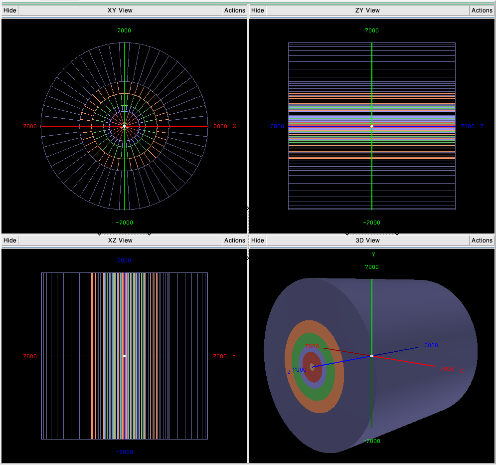
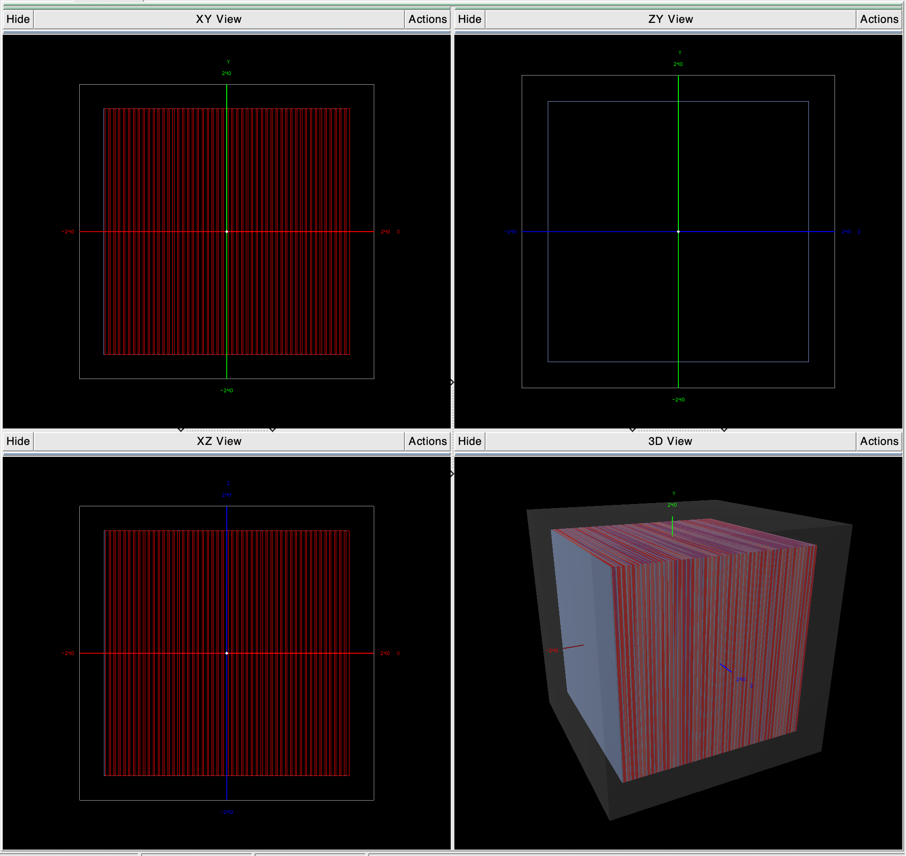
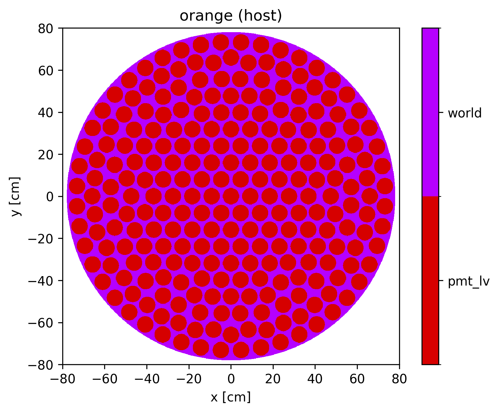
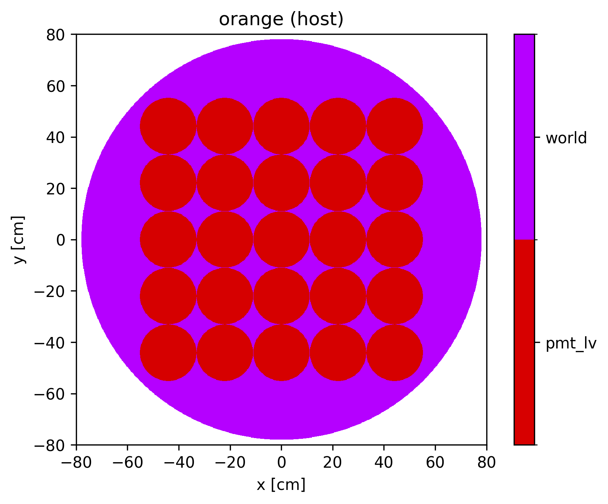

# GDML Generator
Export programmatic geometries to GDML, including secondary production cuts.


# Dependencies
Geant4 with `GEANT4_USE_GDML=ON` .


# Build
```shell
$ mkdir build; cd build;
$ cmake ..; make
```


# Run
```shell
$ ./gdml-gen [geometry_enum]
```
For the segmented simple cms, the number of segments are also needed:
```shell
$ ./gdml-gen [4 or 5] [num_segments_r] [num_segments_theta] [num_segments_z]
```

The available geometries are:

| Enum | Geometry description |
| ---- | -------------------- |
| 0    | `G4_Pb` cube of 500 m side ("infinite") |
| 1    | Four `G4_STAINLESS-STEEL` slabs in a vacuum |
| 2    | Simple CMS with simple materials |
| 3    | Simple CMS with composite materials |
| 4    | Segmented simple CMS with simple materials |
| 5    | Segmented simple CMS with composite materials |
| 6    | [TestEm3][testem3] with simple materials |
| 7    | [TestEm3][testem3] with composite materials |
| 8    | Flattened [TestEm3][testem3] with simple materials (for ORANGE only) |
| 9    | Flattened [TestEm3][testem3] with composite materials (for ORANGE only) |
| 10   | Set of boxes with optical properties |
| 11   | Thin Pb slab for MSC validation |
| 12   | Simplifed LUX-Zeplin (LZ) model |
| 13   | Muon-catalyzed fusion test geometry |
| 14   | Muon-catalyzed fusion dt target only |
| 15   | Optical prism |
| 16   | Notional JUNO model |

[testem3]: https://github.com/apt-sim/AdePT/tree/master/examples/TestEm3

Secondary production cut thresholds are set equally for protons, electrons,
positrons, and gammas and are set to 0.7 **[mm]**.


# Adding new geometries
To make the addition of new geometries easier, all the basic mandatory classes
are stored in `/src/core`, leaving the `/src` directory only with the different
geometries created by different implementations of
`G4VUserDetectorConstruction`.

Addition of new geometries todo list:
- Add new concrete `GeometryName` class implementation of
  `G4VUserDetectorConstruction` in `src/`  
- Add the new geometry to the `gdml-gen.cc` by expanding:  
  - `GeometryID` enum.  
  - `label` free function  
  - `switch` statement in `int main()`:  
    ```cpp
    switch (geometry_id) {
        // (...)
        case GeometryID::geometry_name:
            run_manager->SetUserInitialization(new GeometryName());
            gdml_filename = "geometry_name.gdml";
            break;
        // (...)
    }
    ```
- Update this README


# Implemented geometries

## Simple CMS

| Volume                       | Composition      | Dimensions [cm]          |
| ---------------------------- | ---------------- | ------------------------ |
| world volume                 | H (G4_Galactic)  | [1000, 1000, 2000]       |
| vacuum tube                  | H (G4_Galactic)  | [0, 30 - gap, 1400]      |
| silicon tracker              | Si or SiO2       | [30, 125 - gap, 1400]    |
| electromagnetic calorimeter  | Pb or Pb3O4      | [125, 175 - gap, 1400]   |
| hadron calorimeter           | C                | [175, 275 - gap, 1400]   |
| superconducting solenoid     | Ti               | [275, 375 - gap, 1400]   |
| muon chambers                | Fe               | [375, 700, 1400]         |

- The `World volume` is a box, and its dimensions are expressed in cartesian
coordinates `[x, y, z]`.  
- **All** other volumes are concentric cylinders, and their dimensions are
expressed as `[inner radius, outer radius, length]`
- Different gaps between volumes are set so that geometry navigation can be
tested. These values are defined in `SimpleCMSDetector::volume_gaps_`. Current
configuration uses:

  | Volume                       | Gap type   |
  | ---------------------------- | ---------- |
  | world                        | N/A        |
  | vacuum tube                  | tolerance  |
  | silicon tracker              | tolerance  |
  | electromagnetic calorimeter  | overlap    |
  | hadron calorimeter           | overlap    |
  | superconducting solenoid     | millimeter |
  | muon chambers                | N/A        |

### Coordinate system
The origin of the coordinate system is at the center of the geometry, which was
designed to have the same dimensions in every axis, for simplicity. The detector
limits are located at:

| Axis | Limits [cm] |
| ---- | ----------- |
| x    | [-700, 700] |
| y    | [-700, 700] |
| z    | [-700, 700] |

Values are in `mm` in the figure.



## TestEm3
The TestEm3 consists of a world volume with a calorimeter. The calorimeter has
50 daughter volumes, each being a layer containing 2 volumes: a slab
representing a gap (light blue) and an absorber (red).

| Volume   | Material    | Size (x, y, z) [cm] |
| -------- | ----------- | ------------------- |
| World    | G4_Galactic | (48, 48, 48) |
| Gap      | Pb or PbWO4 | (40, 40, 0.23) |
| Absorber | LAr         | (40, 40, 0.57) |


Note: The materials assigned to the gap and absorber appear to be mistakenly
inverted in AdePT's implementation. This choice is replicated here for
consistency. Figure axes are in `mm`.




## Optical properties geometry

Scintillation data is taken from
[SSLG4](https://github.com/mkandemirr/SSLG4/tree/main). The materials defined
in the README table have their data also shown
[here](https://neutrino.erciyes.edu.tr/SSLG4/).

## Simple-LZ

This geometry has two options, based on the the sqrt_num_pmts parameter. If
this parameter is not supplied, a simplifed model of the LZ top PMT detector
array is created, with 253 PMTs in their actual positions. This option is shown 
below:



Alternatively, if sqrt_num_pmts is positive, then a square-pitch sqrt_num_pnts
by sqrt_num_pmts array of detectors created. The PMTs are spaced 1 mm apart, and
sized such that the array is inscribed within the world cyclinder.  These
notional geometries are useful for performance studies. One such example is
shown below, with sqrt_num_pmts = 5:



### Coordinate system
For both geometry options, the geometry limits are:

| Axis | Limits [cm] |
| ---- | ----------- |
| x    | [-78.0288, 78.0288] |
| y    | [-78.0288, 78.0288] |
| z    | [-12.3,    12.3]    |

## Notional-JUNO
Jiangmen Underground Neutrino Observatory (JUNO) is a neutrino detector
consisting of ~40,000 PMTs arranged around a massive spherical tank of liquid
scintillator. The large number of PMTs in this configuration is a challenge
from the standpoint of computational geometry. Here, a "notional" JUNO
model is created, allowing the number of PMTs to be varied to study scaling
behavior.

This notional model consists of only the PMTs, arranged in a sphere. Each PMT
itself is modeled as a sphere. The user must specify:

1. device radius, i.e., radius of the imaginary spherical shell that contains
the PMT centers,

2. PMT radius,

3. number of PMTs.

These PMTs are automatically arranged into a spherical configuration using the
Fibonacci Sphere algorithm. The file "figures/notional_juno.mp4" shows z-slices
through an example of this geometry created with a device radius of 50 cm and
200 PMTs of radius 3 cm.

### Coordinate system
The geometry limits are:

| Axis | Limits [cm] |
| ---- | ----------- |
| x    | [-r, r]     |
| y    | [-r, r]     |
| z    | [-r, r]     |

where r = device_radius + detector_radius
